LicPy
=================================

There are a number of techniques to image vector fields. The most common one, known as hedgehog, is to draw an arrow at each point with a heading and a size matching the direction and magnitude of the vector field at that particular point (e.g. ``quiver`` in Matplotlib). Cabral and Leedom :cite:`Cabral1993` proposed a new method to image vector fields called *line integral convolution* (LIC). LicPy is our implementation in Python of the LIC method.

The method requires one to take a random noisy background texture, and for each pixel of the texture, streamlines of equal length are computed along the input vector field. One then integrates the background pixel values along each streamline to produce a single pixel value and a corresponding output texture. The output looks like a blurred version of the input, where the blurring is along the direction of the vector field that is being visualized, and is easy for the human eye to interpret.

After generating the random texture, one needs to ensure that the input vector field and the random texture are of the same size, i.e. for each texture pixel there must be a single corresponding vector field value. If that is not the case, for example, if the vector field is sampled less densely, one can easily interpolate in a piecewise linear fashion to compute a value per texture pixel. Then, given a point (marked with x in Figure 1) one computes a stream-line going through that point both in the forward (as on the figure) and backward directions. 

.. image:: lic.png
    :scale: 40%

**Figure 1:** Streamline.

This is easy to do since the vector field is piecewise constant within each pixel, so the streamlines are straight line segments within each pixel. Computing them is merely a matter of figuring out where the straight line intersects the rectangular boundaries of the pixel. Once the streamlines are computed, the random background texture colors are averaged over their length, resulting in a new color for each pixel.

The output image produced in this fashion is more intuitive to the human eye to interpret because it looks like the smearing of ink along a moving fluid. Figure 2 illustrates a number of vector fields that are visualized using both quiver plots (QVR) and LIC plots. Notice how the LIC plots remain well-behaved even in the presence of singularities near which the quiver plots are hard to parse. 

+----------------+----------------+
|    QVR         +  LIC           |
+================+================+
|  |F00.arr|     |   |F00.lic|    |
+----------------+----------------+
|  |F01.arr|     |   |F01.lic|    |
+----------------+----------------+
|  |F02.arr|     |   |F02.lic|    |
+----------------+----------------+
|  |F03.arr|     |   |F03.lic|    |
+----------------+----------------+
|  |F04.arr|     |   |F04.lic|    |
+----------------+----------------+
|  |F05.arr|     |   |F05.lic|    |
+----------------+----------------+

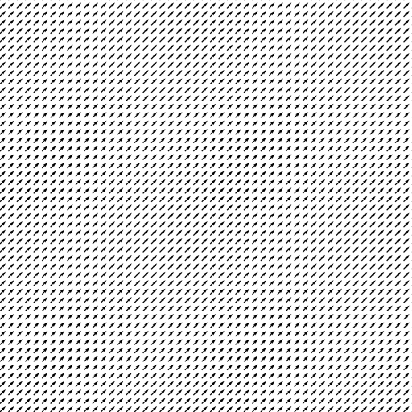
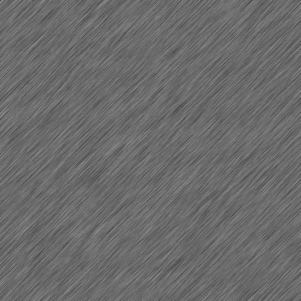
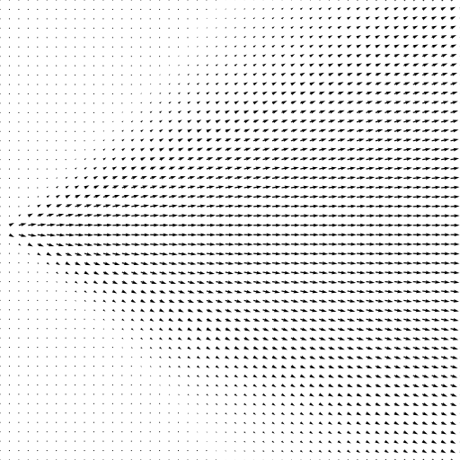
.. |F01.lic| image:: ../licpy/vectorfields/jetx_funnel.lic.png
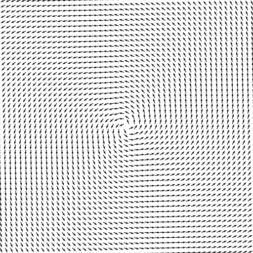
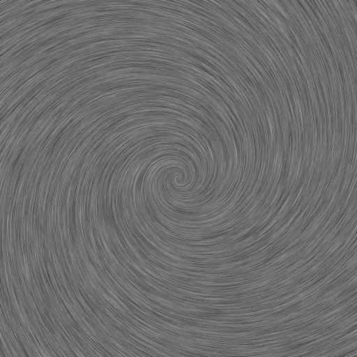
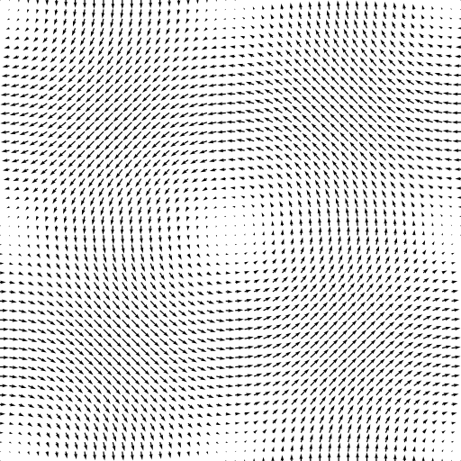
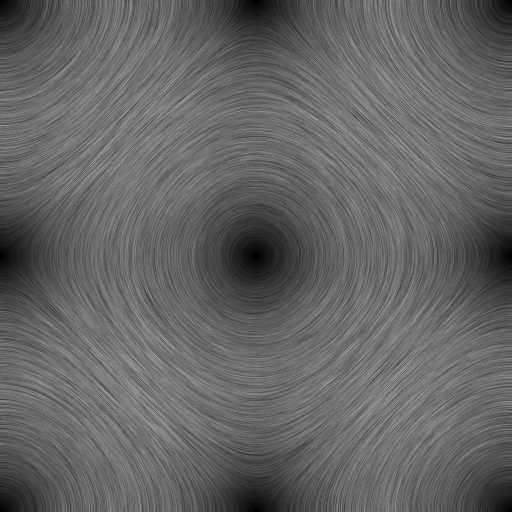
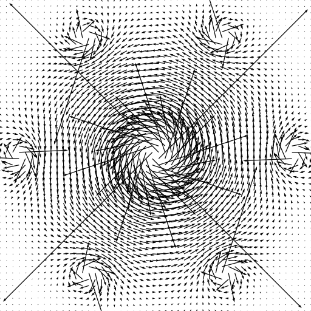
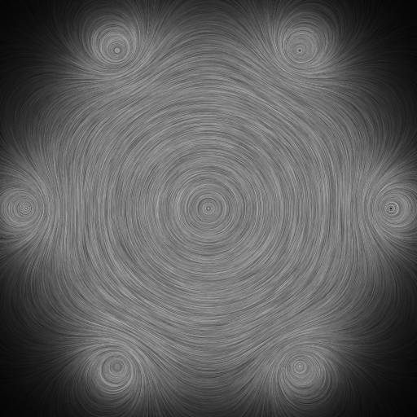
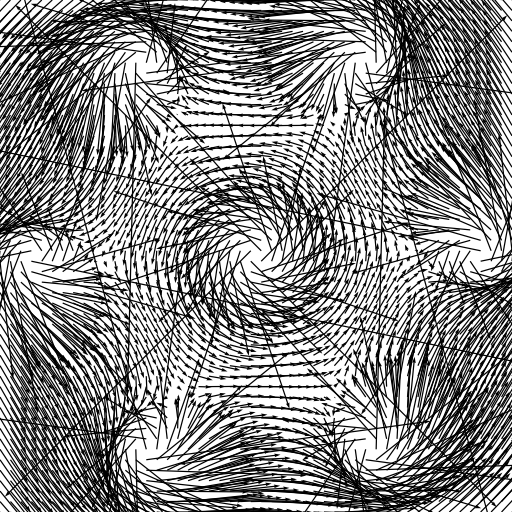
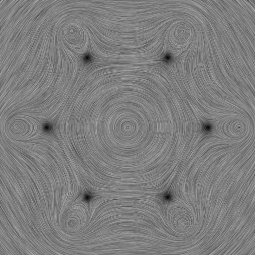

**Figure 2:** Comparison of quiver plots generated using Matplotlib (QVR) with line integral convolution plots generated by LicPy (LIC).

Usage
------

To understand how the LicPy library is to be used, one can take a look at the :py:mod:`licpy.command.vf` module, and the :py:func:`lic` function in particular. The important code snippet is

.. code-block:: python

    from licpy.lic import runlic
    tex = runlic(vx, vy, L)
    grey_save(dest, tex)

The :py:func:`runlic` function does most of the heavy-lifting. It takes as arguments the x- and y-component of the velocity at each pixel position, and the lenght L of the stream along with to convolute, and the result is returned as a grey-scale texture, which can then be saved into an image file using the :py:func:`grey_save` function.

References
------------

.. bibliography:: references.bib
